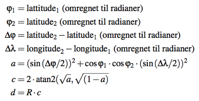

### Oppgave 3 - GPS hjelpemetoder

I oppgave 2 har vi implementert det som trengs for å lese inn GPS data og konvertere det til tall lagret i GPSPoint-objekter  som vi kan gjøre beregninger på. Vi skal nå implementere noen hjelpe-metoder i klassen `GPSUtils.java` som vi skal bruke seinere i prosjektet.

Gjør ferdig implementasjonen av følgende metoder i klassen og bruk enhetstestene i klassen `GPSUtilsTester.java` til løpende å teste koden.

#### 3a)

```java
double findMin(double[] da)
```

som finner minste tall i en tabell med flyttall. Det kan antas at der er minst et element i tabellen. **Hint:** se på implementasjonen av metoden `findMax` som allerede finnes i klassen.

#### 3b)

```java
public static double[] getLatitudes(GPSPoint[] gpspoints)
```

som tar en tabell med GPS-punkt og returnerer en tabell av desimaltall inneholdende breddegradene for GPS-punktene. **Hint:** metoden skal først opprette en tabell av desimaltall med samme som `gpspoint` og så kopierer de enkelte breddegrader over i den nye tabellen. Husk at `getLatitudes`-metoden på et `GPSPoint`-objekt kan brukes til å lese ut breddegrad i objektet.   

#### 3c)

```java
public static double[] getLongitudes(GPSPoint[] gpspoints)
```

som er tilsvarende `getLatitudes`-metoden ovenfor men for lengdegrader.

#### 3d)

```java
public static double distance(GPSPoint gpspoint1, GPSPoint gpspoint2) {

```

som beregner avstanden *d* i meter mellom to punkter på jordkloden ved bruk av Haversine-formlen



der *R = 6371000* meter er jordens gjennomsnittsradius.

**Hint**: Se på oppgave 5 fra programmerinslab 8: https://github.com/dat100hib/dat100public/blob/master/programmering/jplab8/JP8.md Dette gjelder også oppgaven som følger nedenfor.

#### 3e)

```java
public static double speed(GPSPoint gpspoint1, GPSPoint gpspoint2) {
```

som beregninger gjennomsnittshastighet i **km/t** om man beveger seg fra punktet gitt ved `gpspoint1` til punktet `gpspoint2` på det antall sekunder som er gitt med parameteren secs.

#### 3f)

```java
public static String formatTime(int secs)
```

som returnerer en streng der tiden i sekunder fra midnatt gitt av parameteren secs på formatet `hh:mm:ss` der `hh` er antall timer, `mm` er antall minutter og `ss` er antall sekunder. Videre skal metoden legge inn mellomrom foran tiden slik den total lengden på strengen blir 10. **Hint:** se på `format`-metoden i `String`-klassen.`

#### 3g)

```java
public static String formatDouble(double d)
```

som runder av et flyttall til to desimaler, setter resultat inn i en streng og fyller på med mellomrom foran i strengen slik at lengden på strengen blir 10.
