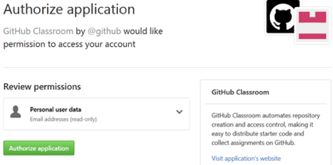
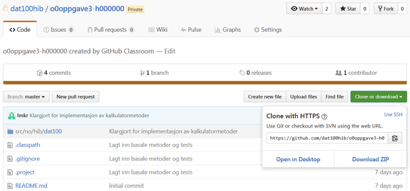

# Oppgave 0: Eclipse-prosjekt med startkode og enhetstester

Dere skal ta utgangpunkt i to Eclipse-prosjekt.

Det ene Eclipse-prosjekt inneholder en rekke Java-klasser som utgjør rammen rundt en sykkelcomputer-applikasjonen. Dere trenger ikke å legge til nye klasser, men dere skal implementere ulike metoder i klassene som er gitt.

Det andre Eclipse-prosjektet inneholder en rekke enhetstester som skal bruke til automatisk å teste den koden dere skriver.

## a) Eclipse-prosjekt med startkode

Gruppen får adgang til startkoden via [GitHub classroom](https://classroom.github.com/) som er en overbygging på github.

### Steg 1 - Akseptere programmeringsoppgaven

Første steg er å akseptere programmeringsoppgaven for å få tilgang til den Java-kode du skal ta utgangspunkt i.

Gruppen får adgang til startkoden ved at en av gruppemedlemmene åpner en nettleser og går til følgende adresse (URL):

https://classroom.github.com/a/yHWK65mq

Ved å gå til denne adressen kommer du inn i github classroom og kan akseptere oppgaven:

1.	Trykk på *Authorize application*

    

2.	Velg *Accept this assignment*

    

3.	Trykk på lenken rett etter *your assignment has been created here*. Slutten på den lenken du får vil ikke være helt identisk med det er vist på billedet siden det er en lenke til din egen oppbevaringsplass for den koden du skal ta utgangspunkt i.

    

### Steg 2 - Laste ned og importere startkode

Du må nå laste ned (klone) oppbevaringsplassen med kode som du skal ta utgangspunkt i:

1.	Velg *Clone or Download* på github-siden i nettleseren som kom frem etter punkt 3 ovenfor.

2.	Velg lenken og klon oppbevaringsplassen på samme måten som du gjorde i oppgave 3b på første programmeringslab: https://github.com/dat100hib/dat100public/blob/master/programmering/jplab1-onsdag/JP1.md#oppgave-3-sjekke-ut-kode-fra-github

men nå med oppbevaringsplassen gitt i lenken ovenfor.

Du skal nå ha et prosjekt i Eclipse med navnet `dat100-prosjekt-2019`

Eclipse-prosjektet er organisert i et antall pakker svarende til hver oppgave i programmeringsprosjektet. Pakkene inneholder de klasser og metoder som gruppen skal implementere i oppgavene som presenteres nedenfor.

De steder i koden hvor dere skal implementere Java-kode er merket med en kommenter og teksten `TODO`. Disse plassene i koden kan lett identifiseres ved at de gir en blå markering i høyresiden av editor-vinduet i Eclipse.

For å kjøre det enklere ifm. presentasjon av oppgaven å finne de plassene hvor dere har lagt til kode, anbefales det å la kommentarene med `TODO – START` og `TODO SLUTT` bli stående i koden.  

## b) Eclipse-prosjekt med enhetstester

Formålet med enhetstestene er å gjøre det enklere å teste metoder etterhvert som de implementeres uten å skulle starte selve sykkelcomputer-applikasjonen.  

Eclipse-prosjekt med enhetstester finnes finnes på følgende github oppbevaringsplass:

https://github.com/dat100hib/dat100-prosjekt-testing-2019

Du kloner oppbevaringsplassen på samme måten som du gjorde i oppgave 3b på første programmeringslab: https://github.com/dat100hib/dat100public/blob/master/programmering/jplab1-onsdag/JP1.md#oppgave-3-sjekke-ut-kode-fra-github

men nå med oppbevaringsplassen gitt i lenken ovenfor.

Du skal nå ha et prosjekt i Eclipse med navnet `dat100ptc-testing-2019` som inneholder en rekke enhetstester (unit-tests) implementert ved bruk av rammeverket JUnit. Det er ikke et krav i prosjektet å legge til flere enhetstester.

Konvensjonen er at enhetstester for en klasse `X.java` er implementert i filen med navn `XTester`.java. Eksempelvis inneholder klassen `GPSUtilsTester.java` enhetstester for klassen `GPSUtils.java` hvor dere skal implementere metoder.

## c) Utføre JUnit enhetstest

En test-klasse med enhetstest utføres ved å velge test-klassen etterfulgt av *Run As → JUnit Test*. Man kan kjøre alle testene i en test-pakke ved å velge pakken etterfulgt av *Run As → JUnit Test*. Alle testene i Eclipse-prosjektet kjøres ved å velge prosjektet etterfulgt av *Run As → JUnit Test*.

Det er god/anbefalt praksis å gjenta testene når det gjøres endringer/forbedringer i implementasjonen av en metode. Det anbefales også å teste etterhvert som de enkelte metoder implementeres. Enhetstestene er ikke komplette, men tester basale ting for metodene i de klasser som dere skal implementere.

Enhetstesting og test-drevet utvikling er et tema senere i studiet og det er et generelt godt ingeniørprinsipp å teste komponentene sine før de settes sammen til et større system.

I mappen `logs` i Eclipse-prosjektet finnes tre CSV filer filer: `short.log`, `medium.log`, `long.log` og `vm.log` med GPS data punkter som kan brukes som input til Java sykkelcomputeren.

## d) Dele oppbevaringsplass mellom gruppemedlemmer

Hvis gruppen ønsker å bruke en felles github-oppbevaringsplass for koden, er det tilstrekkelig at en i gruppen aksepterer oppgaven som beskrevet i a) og deretter gir de andre medlemmene i gruppen tilgang til oppbevaringsplassen (repository). Dette kan gjøres ved å logge inn på www.github.com, gå til oppbevaringsplassen og via *Settings* for oppbevaringsplassen legge til de andre medlemmer i gruppen som *Collaborators*.

De andre gruppemedlemmene må da klone oppbevaringsplassen ned på egen PC ved å velge *File → Import → Git → Projects from Git → Clone URI* i Eclipse og lime inn URL’en til den felles oppbevaringsplassen. Endringer i filer i prosjektet lastes opp til den felles oppbevaringsplassen ved å bruke  *Team | Add to Index* etterfulgt av *Team | Commit … | Commit and Push* og hentes ned ved å bruke *Team | Pull*.
